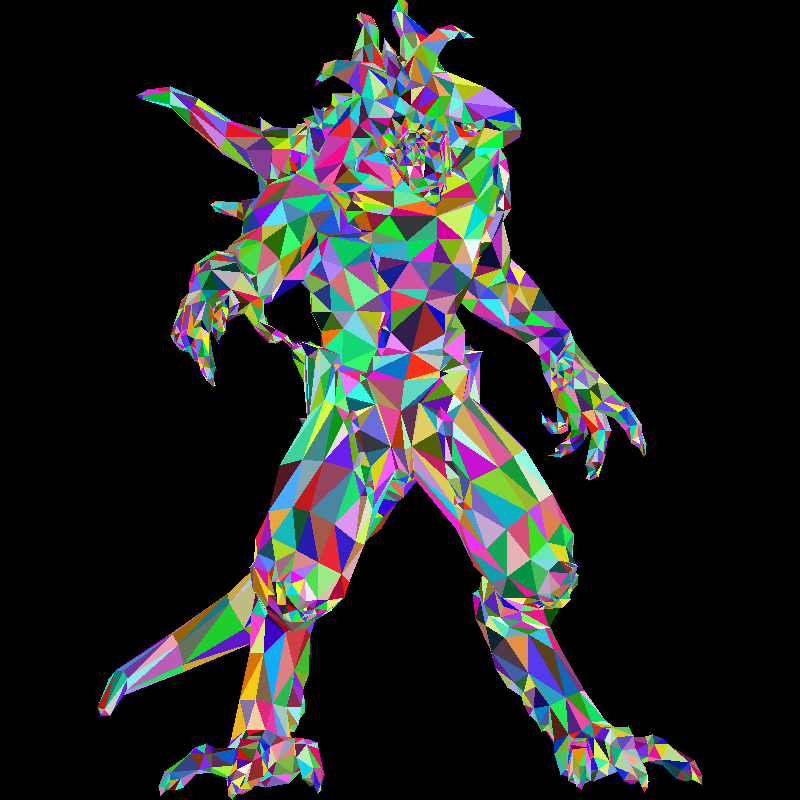
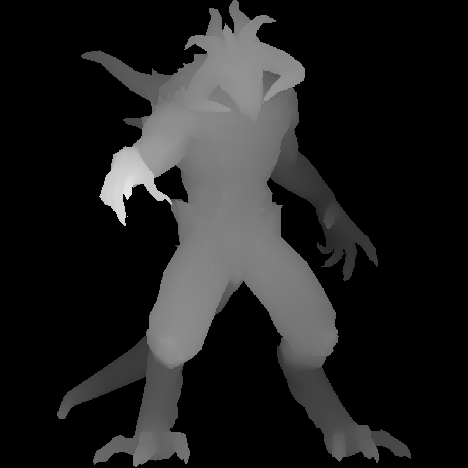

# tinyrenderer-rs

A tiny **software rasterizer written in Rust**, built from scratch by following and adapting the
[**TinyRenderer**](https://haqr.eu/tinyrenderer/) tutorial (originally in C++).
The goal is to deeply understand the **entire 3D rendering pipeline** — without GPU APIs,
drivers, or hidden magic.

This is a **learning project**, not a production renderer.

---

## Goals

- Learn how a modern raster pipeline actually works
- Reimplement the TinyRenderer tutorial in **idiomatic Rust**
- Improve Rust skills (ownership, lifetimes, performance-aware code)
- Keep everything small, readable, and debuggable

## Examples

Rendering a 3D model with random colors and z-buffer depth testing:

  
  

_Left: Final render with random triangle colors | Right: Z-buffer depth visualization_
